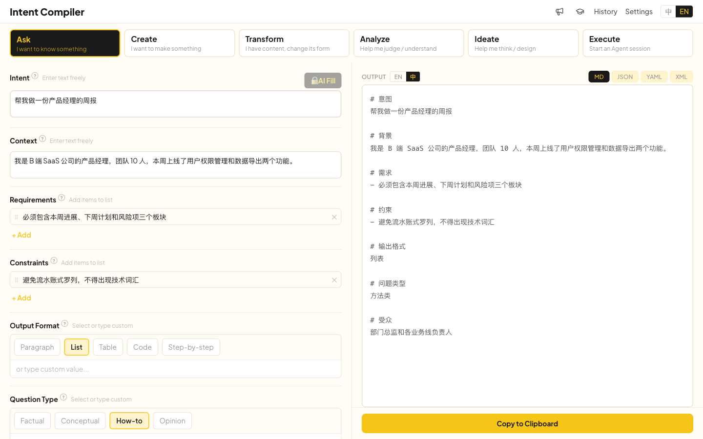

# Intent Compiler

[](LICENSE)
[](https://www.simon-wong.cn/intent-compiler)
<!-- [](https://github.com/Simon-Wong-hjz/intent-compiler/actions) -->

> Tired of writing AI prompts from scratch every time? Intent Compiler breaks common tasks into structured fields, helping you quickly "compile" high-quality prompts.



Intent Compiler is a client-side prompt compiler. Pick a task type → fill in structured fields → get your compiled result in one click. Use the output directly as a prompt in AI conversations, as structured constraints alongside natural language, or to kick off an Agent session — with an optional AI-enhanced mode for auto-filling fields.

## Highlights

- **6 Task Templates** — Ask, Create, Transform, Analyze, Ideate, Execute — guiding you to think structurally
- **Progressive Disclosure** — Starts with curated core fields; expand for more detail as needed, suitable for all skill levels
- **Live Preview** — What you edit is what you see, what you see is what you get
- **Multi-Format Output** — Markdown, JSON, YAML, XML — fits different models and use cases
- **Privacy First** — Runs entirely client-side, data stored locally, no intermediate servers
- **AI-Enhanced (Optional)** — Connect your OpenAI API key for AI-powered field filling

## Live Demo

👉 [www.simon-wong.cn/intent-compiler](http://www.simon-wong.cn/intent-compiler)

No installation needed — open and use.

## Getting Started

Requires Node.js 20+ and npm 9+.

```bash
git clone https://github.com/Simon-Wong-hjz/IntentCompiler.git
cd IntentCompiler
npm install          # Install dependencies
npm run dev          # Start dev server (Vite)
npm run build        # Production build
npm run test         # Run tests (Vitest)
```

## Tech Stack

| Layer | Technology |
|---|---|
| Framework | React 19 + TypeScript 6 |
| Build | Vite 8 |
| UI | Tailwind CSS v4 + shadcn/ui |
| i18n | react-i18next |
| Storage | Dexie.js (IndexedDB) |
| Testing | Vitest + React Testing Library |

## Project Status

**Current**: Core features complete — 6 task templates, multi-format output, AI enhancement, bilingual support, local persistence.

**Next up**: Mobile responsiveness, Anthropic API support.

## License

[Apache License 2.0](LICENSE) — Copyright 2026 Simon Wong
