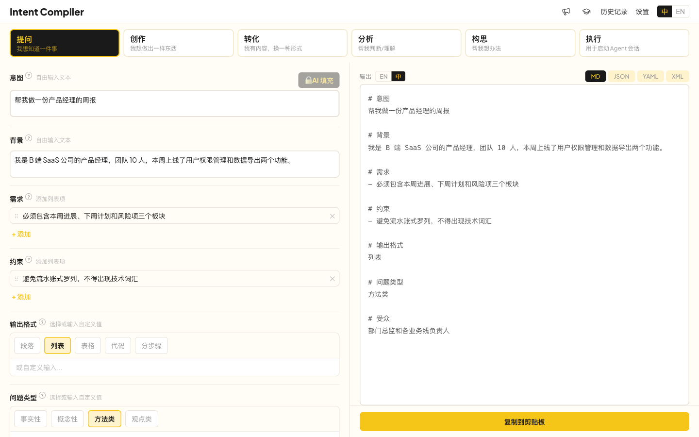

# Intent Compiler

[](LICENSE)
[](https://www.simon-wong.cn/intent-compiler)
<!-- [](https://github.com/YOUR_USER/intent-compiler/actions) -->

> 厌倦了每次从头手搓提示词？Intent Compiler 把常见任务拆成结构化字段，帮你快速"编译"出高质量提示词。



Intent Compiler 是一个纯客户端的提示词编译器。选择任务类型 → 填写结构化字段 → 一键获得编译结果。输出可以直接作为提示词粘贴给 AI 对话，作为结构化约束搭配自然语言使用，或用于启动 Agent 会话。——附带可选的 AI 增强模式，自动填充字段内容。

## 功能亮点

- **6 种任务模板** — 提问、创作、转化、分析、构思、执行，助你结构化思考
- **渐进式引导** — 默认展示精选核心字段，也可按需添加更多细节，适合不同层次用户
- **实时预览** — 编辑即所见，所见即所得
- **多格式输出** — Markdown、JSON、YAML、XML，适配不同模型和使用场景
- **隐私优先** — 纯客户端运行，数据本地存储，无中间服务器
- **AI 增强（可选）** — 支持接入 OpenAI API，AI 自动填充字段

## 在线体验

👉 [www.simon-wong.cn/intent-compiler](http://www.simon-wong.cn/intent-compiler)

无需安装，打开即用。

## 快速开始

需要 Node.js 20+ 和 npm 9+。

```bash
git clone https://github.com/Simon-Wong-hjz/IntentCompiler.git
cd IntentCompiler
npm install          # 安装依赖
npm run dev          # 启动开发服务器 (Vite)
npm run build        # 生产构建
npm run test         # 运行测试 (Vitest)
```

## 技术栈

| 层 | 技术 |
|---|---|
| 框架 | React 19 + TypeScript 6 |
| 构建 | Vite 8 |
| UI | Tailwind CSS v4 + shadcn/ui |
| 国际化 | react-i18next |
| 存储 | Dexie.js (IndexedDB) |
| 测试 | Vitest + React Testing Library |

## 项目状态

**当前**：核心功能已完成 — 6 种任务模板、多格式输出、AI 增强、双语支持、本地持久化。

**下一步**：移动端适配、Anthropic API 适配。

## 许可证

[Apache License 2.0](LICENSE) — Copyright 2026 Simon Wong
